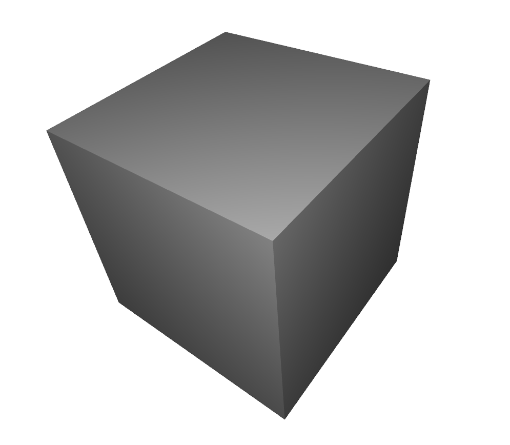
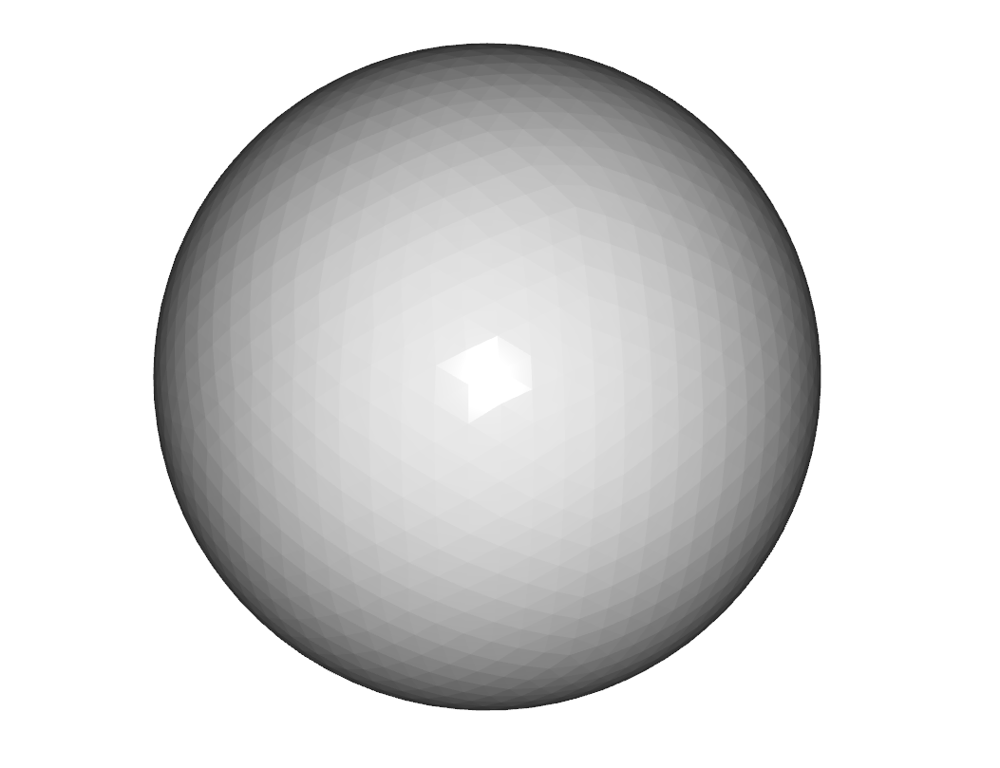
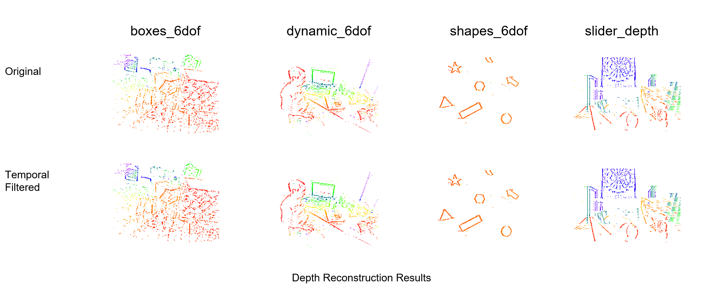
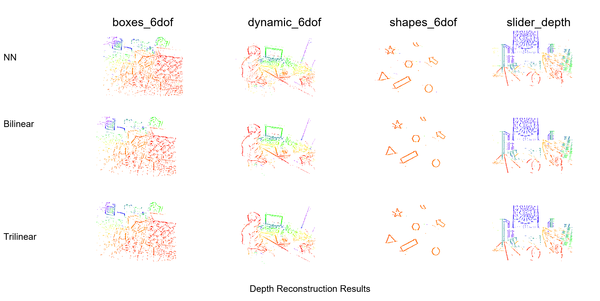

# Event-Based 3D Reconstruction

This project is an event-camera-based 3D reconstruction method using event streams, based on the EMVS pipeline from https://github.com/uzh-rpg/rpg_emvs.

## Requirements

- OS: Ubuntu 20.04
- ROS: Noetic
- CMake: 3.10+

## Dataset

I use the DAVIS event camera dataset provided by UZH RPG:
https://rpg.ifi.uzh.ch/davis_data.html

## Simulator

To generate synthetic event data, I use the DAVIS simulator from UZH RPG:
https://github.com/uzh-rpg/rpg_davis_simulator

## Project Structure

### Workspace root (`emvs_ws/`)

- `src/` : source code (ROS packages)
- `build/` : build artifacts generated by `catkin build`
- `devel/` : devel space generated by `catkin build` (setup files, libs)
- `logs/` : build logs
- `README.md` : project README


### `src/` (main packages)

- `rpg_emvs/` : EMVS pipeline (upstream from UZH RPG)
- `rpg_davis_simulator/` : DAVIS event simulator (UZH RPG)
- `rpg_dvs_ros/` : ROS tools for DVS/DAVIS data
- `eigen_catkin/`, `glog_catkin/`, `gflags_catkin/`, `minkindr/`, `catkin_simple/`, `cnpy/` : third-party dependencies packaged for catkin

### `src/rpg_emvs/`

- `mapper_emvs/` : main EMVS mapping / depth reconstruction package (entry point for running experiments)
- `cartesian3dgrid/`, `depthmaps_png/` : supporting EMVS components/utilities
- `dependencies.yaml` : upstream dependency list
- `SOURCE CODE LICENSE AGREEMENT.doc` : upstream license file

### `src/rpg_emvs/mapper_emvs/`

- `src/`, `include/` : C++ implementation
- `scripts/` : helper scripts (pre/post-processing, evaluation)
- `cfg/` : configuration files
- `calib/` : camera calibration files
- `data/` : dataset-related inputs (bags/events/etc.)
- `NN/`, `trilinear/` : results folders

## Installation

```bash
# prerequisites
sudo apt update
sudo apt install -y git python3-catkin-tools python3-rosdep
sudo rosdep init || true
rosdep update

# clone
git clone <YOUR_REPO_URL>
cd emvs

# build
source /opt/ros/noetic/setup.bash
rosdep install --from-paths src --ignore-src -r -y
catkin build
source devel/setup.bash
```

## Quick Demo

```bash
# go to the EMVS mapper package
roscd mapper_emvs

# download an example bag
wget -O shapes_6dof.bag https://rpg.ifi.uzh.ch/datasets/davis/shapes_6dof.bag

# run EMVS
rosrun mapper_emvs run_emvs \
  --bag_filename=$(pwd)/shapes_6dof.bag \
  --flagfile=cfg/slider_depth.conf
```

Output will be generated in the same directory (`mapper_emvs/`). Typical outputs include:

- `dsi.npy` (Depth Space Image / voting volume)
- `depth_map.png` and `depth_colored.png`
- `confidence_map.png`
- `semidense_mask.png`
- `pointcloud.pcd` (reconstructed point cloud)


## Improvements

I implemented three practical improvements on top of the EMVS pipeline.

### 1) Polarity Filtering
**File:** `data_loading.cpp`  
**Function:** `parse_rosbag(..., std::vector<dvs_msgs::Event>& events_, ...)`  

All events are first pushed into `events_`. After loading finishes, I apply **polarity filtering** by keeping only events with the desired polarity (e.g., only ON events or only OFF events). This reduces the number of events and speeds up the downstream DSI computation.

### 2) Temporal Density Filtering
**File:** `data_loading.cpp`  
**Function:** `parse_rosbag(..., std::vector<dvs_msgs::Event>& events_, ...)`  

After all events are collected in `events_`, I run a **temporal density filter**: isolated events without nearby neighbors within a small time window are removed. This suppresses noise events and improves depth quality.

### 3) Optional Voting Strategy (NN / Bilinear / Trilinear)
**File:** `mapper_emvs.cpp`  
**Function:** `fillVoxelGrid()`  

Voxel voting is implemented in `fillVoxelGrid()`. I added an option to switch between different voting strategies:
- **Nearest-Neighbor (NN):** each event votes to the closest voxel (fastest)
- **Bilinear:** vote is split across neighboring (x, y) voxels (smoother)
- **Trilinear:** vote is split across (x, y, z) voxels (best quality)

## Results and Analysis

I evaluated the EMVS on two simulated synthetic shapes (a **box** and a **sphere**). 





### Quantitative Results

| Scene          | Accuracy (m) | Completeness (m) | Chamfer (m) |                      F@0.05 |                      F@0.10 |
| -------------- | -----------: | ---------------: | ----------: | --------------------------: | --------------------------: |
| Box (better)   |        0.089 |            0.120 |       0.209 | 0.371<br>(P=0.501, R=0.295) | 0.705<br>(P=0.865, R=0.595) |
| Sphere (worse) |        0.168 |            0.197 |       0.365 | 0.098<br>(P=0.180, R=0.068) | 0.255<br>(P=0.389, R=0.190) |

*Quantitative point-cloud evaluation on synthetic shapes.*

Using EMVS gives unsatisfactory results likely because the synthetic scenes have low texture so events are sparse/weak, and the evaluation is also biased since EMVS outputs an accumulated point cloud while the GT is taken from a single frame, so the mismatch can inflate the measured error.

### Qualitative Results

#### **True / False Event Filtering**


True/False event filtering produces almost the same 3D reconstruction as using all events, while cutting the event count by about 50% and significantly improving efficiency.

#### **Temporal Density Filtering**



Temporal density filtering drops isolated noise events (no neighbor within ±0.5 ms), but the improvement is limited in my results.

#### **Voxel Voting Methods**


NN voting is fastest but tends to produce noisier, less stable depth since each event votes to only one voxel, while bilinear and especially trilinear voting spread evidence to neighboring voxels to smooth the DSI and improve depth quality (at the cost of more computation).


## References

- EMVS (base pipeline): https://github.com/uzh-rpg/rpg_emvs  
- DAVIS dataset (bag files): https://rpg.ifi.uzh.ch/davis_data.html  
- DAVIS simulator: https://github.com/uzh-rpg/rpg_davis_simulator  

